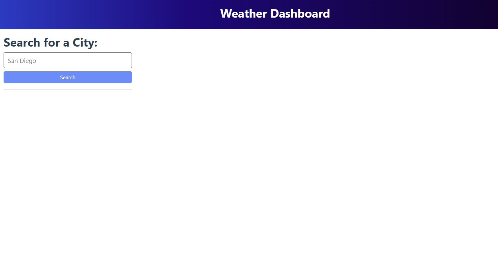
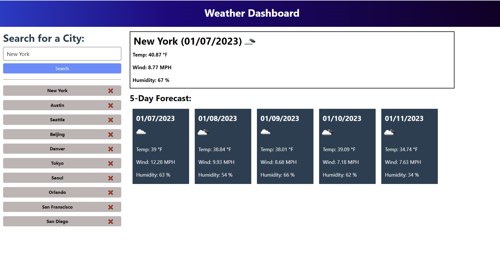
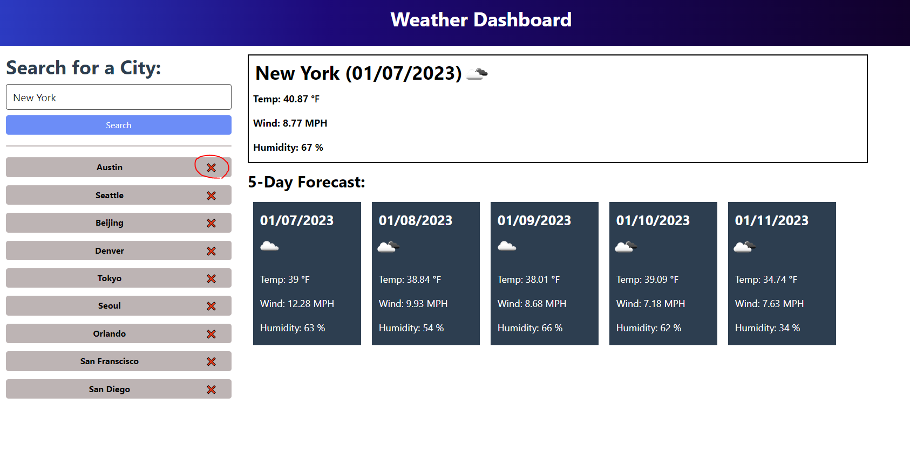
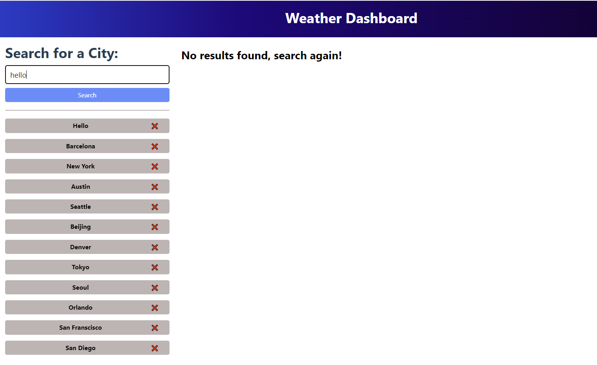

# Weather Dashboard

## Task for Weather Dashboard

Third-party APIs allow developers to access their data and functionality by making requests with specific parameters to a URL. Developers are often tasked with retrieving data from another application's API and using it in the context of their own. This challenge is to build a weather dashboard that will run in the browser and feature dynamically updated HTML and CSS.

In this task, the [5 Day Weather Forecast](https://openweathermap.org/forecast5) is used to retrieve weather data for cities. The base URL should look like the following: `https://api.openweathermap.org/data/2.5/forecast?lat={lat}&lon={lon}&appid={API key}`. After registering for a new API key, may need to wait up to 2 hours for that API key to activate.

`localStorage` will be used to store any persistent data. For more information on how to work with the OpenWeather API, refer to the [Full-Stack Blog on how to use API keys](https://coding-boot-camp.github.io/full-stack/apis/how-to-use-api-keys).

## User Story

```
AS A traveler
I WANT to see the weather outlook for multiple cities
SO THAT I can plan a trip accordingly
```

## Acceptance Criteria

```
GIVEN a weather dashboard with form inputs
WHEN I search for a city
THEN I am presented with current and future conditions for that city and that city is added to the search history
WHEN I view current weather conditions for that city
THEN I am presented with the city name, the date, an icon representation of weather conditions, the temperature, the humidity, and the wind speed
WHEN I view future weather conditions for that city
THEN I am presented with a 5-day forecast that displays the date, an icon representation of weather conditions, the temperature, the wind speed, and the humidity
WHEN I click on a city in the search history
THEN I am again presented with current and future conditions for that city
```

## Mock-Up

The following image shows the web application's appearance and functionality:


## Description

* A link to deployed application: https://taeyoungp.github.io/Weather_Dashboard/

The following images demonstrate the application functionality:


When user opens up the page, user can see search bar on the left side of the page. User can input city's name in the search bar to get info of that city's weather forecast. (Today's and future 5 days' weathers)



After user searching city, its weather data will display on the page, including city name, date, weather icon, temperature, wind speed, and humidity. 

Also under the search bar, the list of searched city histories will be displayed. User can click these histories to search the weather forecast of the city again.

(Note: Most recently searched city name will be displayed at the top of history list and older ones to the bottom. However, when the user clicks searched city name from history list, the order of list remains same.)



User can also delete their searched city history by clicking 'X' button next searched city name. 



If the user searched for invalid city name, or if the weather api could not fetch the weather data, the page wiil says 'No result found, search again!' 

(Note: Invalid city name will still be added to searched history, thus user needs to delete the history manually if they desire.)


## How to use

 * User can check today's date and 5 days forecast by seraching city name from search bar on the left side of the webpage. Search function is not uppercase/lowercase sensitive, but user must input correct and precise city name. 

 * Date shown in weather forecast is based on city's local timezone.  

 * Searched history will appear under search bar section. This list of histories will be saved in webpage. User can also delete history of each searched cities by clicking 'X' sign next to searched city. 

 * User can research city by clicking searched city history displayed under search bar.  

## Credits
 
> * Converting date data to different formats: https://stackoverflow.com/questions/62376115/how-to-obtain-open-weather-api-date-time-from-city-being-fetched, https://stackoverflow.com/questions/65746475/how-to-get-data-info-from-openweathermap-api-dt, https://www.w3schools.com/jsref/jsref_getmonth.asp

> * Code to make first letter of word always an uppercase and rest of them lower case: https://stackoverflow.com/questions/4878756/how-to-capitalize-first-letter-of-each-word-like-a-2-word-city

> * Code to move item in the array to end of the list: https://stackoverflow.com/questions/24909371/move-item-in-array-to-last-position

> * API used in this project (OpenWeatherMAp): https://openweathermap.org/forecast5

- - -
© 2022 edX Boot Camps LLC. Confidential and Proprietary. All Rights Reserved.
